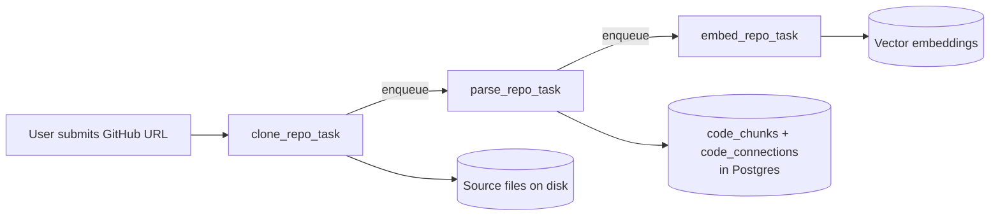
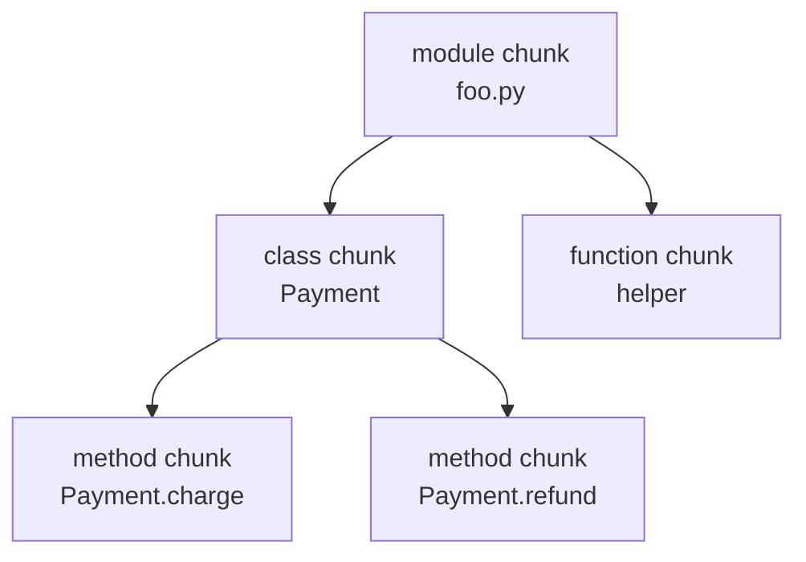
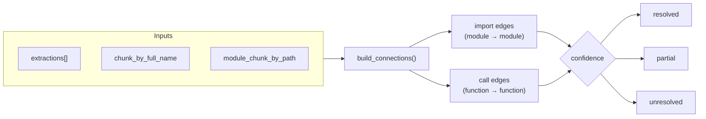
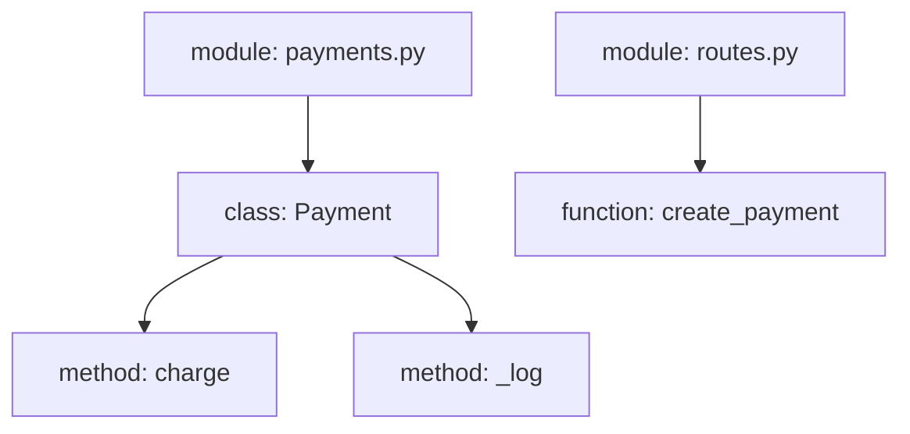

# The Parsing Phase — A Deep Dive (Explained From Scratch)

This document explains, in detail and from first principles, how a raw GitHub
repository becomes a **queryable knowledge graph** of code chunks and connections.
It is written to be understandable by someone new to compilers/static analysis,
while still being precise enough for engineers working on the pipeline.

If you want the short reference version, see [`indexing-pipeline.md`](indexing-pipeline.md).
This document is the long, teach-me-like-a-beginner version.

---

## Table of contents

1. [The big picture](#1-the-big-picture)
2. [Core vocabulary](#2-core-vocabulary-learn-these-first)
3. [Stage 1 — Cloning to disk](#3-stage-1--cloning-to-disk)
4. [Stage 2 — Collecting clean files](#4-stage-2--collecting-clean-files)
5. [Stage 3a — Text to AST (Tree-sitter)](#5-stage-3a--text--ast-tree-sitter)
6. [Stage 3b — AST to symbols (semantic extraction)](#6-stage-3b--ast--symbols-imports-and-calls)
7. [Stage 3c — Symbols to code chunks](#7-stage-3c--symbols--code-chunks)
8. [Stage 3d — Building connections (the edges)](#8-stage-3d--building-connections-the-edges)
9. [Stage 4 — Persisting to Postgres](#9-stage-4--persisting-to-postgres)
10. [A full worked example](#10-a-full-worked-example)
11. [Design decisions and why they matter](#11-design-decisions-and-why-they-matter)
12. [Edge cases and gotchas](#12-edge-cases-and-gotchas)
13. [File-by-file cheat sheet](#13-file-by-file-cheat-sheet)

---

## 1. The big picture

When a user pastes a GitHub URL, we don't parse it immediately in the web
request — that could take minutes. Instead we run a **background pipeline** made
of three jobs on an ARQ (Redis-backed) queue. Each job finishes by enqueuing the
next one.



- **`clone_repo_task`** — download the repo to disk, filter out noise.
- **`parse_repo_task`** — *the parsing phase* — turn code text into structured
  chunks and connections. **This is what this document is about.**
- **`embed_repo_task`** — turn chunks into vector embeddings for semantic search.

The handoff is wired in [`app/ARQ/task.py`](../app/ARQ/task.py): each task ends
with `ctx["redis"].enqueue_job(...)` to trigger the next.

**Mental model:** think of an assembly line. Raw code enters one end; structured,
searchable knowledge exits the other. Each station does one job and passes its
output to the next station.

---

## 2. Core vocabulary (learn these first)

Before diving in, here are the words we'll use constantly.

- **AST (Abstract Syntax Tree):** a tree representation of source code that
  captures its grammatical structure. If code is a sentence, the AST is the
  grammar diagram of that sentence.
- **Tree-sitter:** a fast, battle-tested parsing library (used by GitHub itself)
  that turns source text into an AST for many languages.
- **Symbol:** a *named, meaningful* piece of code — a class, function, or method.
- **Full name (fully-qualified name):** a globally unique dotted path for a
  symbol, e.g. `app.services.urlService.save_repo`. This is the "home address"
  of a symbol inside the repo.
- **Code chunk:** a stored unit of code in the database. It can be a whole file
  (a *module* chunk) or a single symbol (class/function/method chunk). Each chunk
  keeps its own source text + metadata.
- **Connection:** an edge between two chunks — either an **import** (file → file)
  or a **call** (function → function).
- **Semantic chunk:** "semantic" just means the chunk boundaries follow the
  *meaning* of the code (a whole function, a whole class) rather than arbitrary
  cutoffs like "every 500 characters." That's why they're useful for search and
  chat.

The final output is a **graph**: chunks are the **nodes**, connections are the
**edges**.

---

## 3. Stage 1 — Cloning to disk

File: [`app/services/clone_service.py`](../app/services/clone_service.py)

```python
dest = os.path.join(settings.clone_base_dir, owner, repo_name)

if os.path.exists(dest):
    shutil.rmtree(dest)

os.makedirs(dest, exist_ok=True)
Repo.clone_from(github_url, dest, depth=1)
```

Step by step, in plain English:

1. **Pick a destination folder** on disk: `clone_base_dir/<owner>/<repo_name>`.
2. **Wipe any previous copy** (`shutil.rmtree`) so we always start fresh and never
   mix old and new files.
3. **Shallow clone** with `depth=1`. This is important: a normal `git clone`
   downloads the *entire history* of the project (every commit ever made). We
   don't care about history — we only want the current snapshot of the code. A
   shallow clone downloads *just the latest version*, so it's much faster and
   uses far less disk/network.

After cloning, the repo path is saved on the `Repository` row (via
`mark_clone_complete` in the task), so the parsing job later knows where to find
the files.

**Analogy:** you're photographing a building as it looks *today*. You don't need
the blueprints of every renovation it ever had (that's the git history) — just a
clear photo of the current structure.

---

## 4. Stage 2 — Collecting clean files

A real repository is full of things that are **not source code**: images,
compiled binaries, dependency caches, lock files, build output. Feeding those to
a parser is a waste (and often impossible). So we filter aggressively.

File: [`app/services/urlService.py`](../app/services/urlService.py), function
`collect_clean_repo()`.

It walks the entire cloned folder tree with `root.rglob("*")` and drops:

- **Excluded directories** — `.git`, `node_modules`, `venv`, `__pycache__`,
  `dist`, `build`, and many more (`EXCLUDED_DIRECTORIES`).
- **Migration folders and files** — `migrations/`, `alembic/`, `prisma/`, and
  timestamp/Flyway-style filenames. These are auto-generated noise for
  understanding *logic*.
- **Binary / non-source extensions** — images, audio/video, archives, ML model
  blobs, PDFs, fonts, minified assets (`EXCLUDED_EXTENSIONS`).
- **Noise filenames** — lockfiles, `Dockerfile`, `Makefile`, CI configs, editor
  configs (`EXCLUDED_FILENAMES`).
- **Dotfiles** and **empty files**.

Then `read_file_contents()` reads each surviving file as UTF-8 text, silently
skipping anything that can't be decoded (a stray binary) or is blank.

The output is a simple, clean list:

```python
[
    {"path": "app/services/urlService.py", "content": "import re\n..."},
    {"path": "clerk-react/src/App.tsx",     "content": "import ..."},
]
```

**Analogy:** you emptied a moving truck but only kept the books. You threw out the
bubble wrap, packing peanuts, and empty boxes.

> Note: this same filtering runs again at the start of the parsing job via
> `load_files_from_clone()`, so the parser always sees a clean, current file set.

---

## 5. Stage 3a — Text → AST (Tree-sitter)

Now the actual parsing phase begins. Entry point: `parse_repo_task` in
[`app/ARQ/task.py`](../app/ARQ/task.py), which calls
`persist_extraction(db, repo_id, files)`. Everything below happens inside that.

The first problem: a computer can't "understand" a big string of code directly.
We first convert the text into a **tree** describing its structure — the AST.

File: [`app/services/tree_sitter_parser.py`](../app/services/tree_sitter_parser.py)

```python
EXTENSION_TO_LANGUAGE = {
    ".py": "python",
    ".js": "javascript",
    ".jsx": "javascript",
    ".ts": "typescript",
    ".tsx": "tsx",
}
```

- `detect_language(path)` picks the grammar from the file extension.
- `parse_file(content, language)` loads that grammar and returns the root AST node.
  The grammar loader is wrapped in `@lru_cache`, so each language's parser is built
  **once** and reused across thousands of files — a big performance win.

### Why encode to UTF-8 bytes?

```python
tree = parser.parse(content.encode("utf-8"))
```

Tree-sitter reports every node's position as **byte offsets** (`start_byte`,
`end_byte`), not character indexes. Later, to grab the exact source text of a
node, we slice `content[start_byte:end_byte]`. Encoding to UTF-8 keeps those byte
offsets aligned with the original text (important for non-ASCII characters).

### What an AST looks like (conceptually)

For this Python:

```python
def greet(name):
    print(name)
```

The AST is roughly:

```mermaid
flowchart TD
    module["module"] --> fn["function_definition"]
    fn --> nm["identifier: greet"]
    fn --> params["parameters: (name)"]
    fn --> body["block"]
    body --> call["call"]
    call --> callee["identifier: print"]
    call --> args["argument_list: (name)"]
```

The raw AST has a node for *everything* — every colon, parenthesis, and keyword.
We only care about a handful of node types. Extracting those is the next step.

---

## 6. Stage 3b — AST → symbols, imports, and calls

This is where "semantic chunks" are born. File:
[`app/services/ast_extractor.py`](../app/services/ast_extractor.py).

We recursively walk the AST (`_walk_python` for Python, `_walk_js` for JS/TS) and
collect only the meaningful bits into a `FileExtraction`:

```python
@dataclass
class FileExtraction:
    path: str
    language: str
    symbols: list[Symbol]      # classes / functions / methods
    imports: list[ImportRef]   # dependencies
    calls: list[CallSite]      # who-calls-what
    exports: list[str]         # JS/TS exports
```

### The three things we extract

**1. Symbols** — each class/function/method becomes a `Symbol` with rich detail:
name, kind, `full_name`, line range, `parent_full_name`, `signature`, `docstring`,
`decorators`, and `visibility` (public/private based on the leading-underscore
convention).

**2. Imports** — each `import x` / `from a.b import c` becomes an `ImportRef`
holding the module, the imported names, the line, and the kind.

**3. Calls** — every function call becomes a `CallSite` recording *who* is calling
(`caller_full_name`) and *what text* is being called (`callee_text`) and on which
line.

### The key trick: the "breadcrumb stack" for full names

As the walker descends into a class or function, it pushes the current name onto a
stack (`class_stack` / `fn_stack`). This is how a method deep inside a class ends
up with a globally unique full name.

Consider:

```python
# file: app/services/foo.py
class Payment:
    def charge(self):
        ...
```

- Enter `class Payment` → push `"Payment"` onto `class_stack`.
- Enter `def charge` → its full name is built from the module + the stack:
  `app.services.foo.Payment.charge`.

The module part (`app.services.foo`) comes from the file path via
`path_to_module()` (`a/b/c.py` → `a.b.c`).

**Why this matters:** the full name is the symbol's unique "home address." In the
next steps we use it to (a) rebuild the parent→child tree, and (b) resolve a call
like `charge()` back to the exact chunk it refers to.

### Calls are just text — for now

At this stage a call is recorded as raw text, e.g. `self.save` or `db.commit`. It
is **not yet linked** to any target. Linking happens in the connection step,
because to resolve `save` we need to know about *all* symbols across *all* files
first.

```mermaid
flowchart LR
    ast["AST of one file"] --> walk["_walk_python / _walk_js"]
    walk --> sym["symbols[]"]
    walk --> imp["imports[]"]
    walk --> call["calls[]"]
    sym & imp & call --> fe["FileExtraction"]
```

---

## 7. Stage 3c — Symbols → code chunks

File: [`app/services/code_store.py`](../app/services/code_store.py), function
`build_extraction_payload()`.

Now we turn extractions into actual database rows (`CodeChunk`). For **each file**
we create:

1. **One module chunk** — represents the whole file. Its `content` is the entire
   file text; its type is `"module"`; `parentChunkId` is `None` (it's a root).
2. **One chunk per symbol** — for each class/function/method, we slice out *just
   that symbol's source lines* (`_slice_content(content, start_line, end_line)`)
   and store it as its own chunk.

### Building the tree (parent/child)

Every symbol chunk gets a `parentChunkId`, so the chunks form a navigable tree:



To wire parents correctly, the code keeps two lookup tables as it goes:

- `chunk_by_full_name`: maps `"app.services.foo.Payment"` → that chunk's UUID.
- `module_chunk_by_path`: maps `"app/services/foo.py"` → the module chunk's UUID.

When creating a symbol chunk, it looks up `sym.parent_full_name` in these tables
to find the parent's UUID. These same tables are essential for the connection step
(they translate a *name* into a *chunk id*).

### What's inside a chunk's metadata

Each chunk stores a `metadataJson` blob (see `_module_metadata` /
`_symbol_metadata`) including:

- `language`, `semanticKind` (module/class/function/method),
- `signature`, `docstring`, `decorators`, `visibility`,
- `lineCount`,
- `contentHash` — a SHA-256 of the content. This is used later so the embedding
  stage can **skip re-embedding chunks that didn't change**.
- `imports` / `exports`,
- `unresolvedCalls` — the calls made from this chunk that haven't been linked yet
  (some get removed later once resolved).

The resulting DB shape (`CodeChunk` in
[`app/models/repo_models.py`](../app/models/repo_models.py)):

- `id`, `repoId`, `path`, `type`, `name`, `fullName`, `startLine`, `endLine`,
  `content`, `metadata` (JSON), `parentChunkId` (self-referencing FK → the tree).

---

## 8. Stage 3d — Building connections (the edges)

File: [`app/services/connection_builder.py`](../app/services/connection_builder.py),
function `build_connections()`.

If chunks are the **nodes** of the graph, connections are the **edges**. There are
two kinds.

### A) Import connections (file → file)

For each import, we try to resolve the imported module string to a real file path
inside the repo (`_resolve_import_path`). Two cases:

- **Relative import** (`from .utils import x`): count the leading dots to figure
  out how many directories to walk up from the current file, then try every
  extension (`.py`, `.ts`, `.tsx`, `.js`, `.jsx`) and `__init__.py`.
- **Absolute/module import** (`import app.services.foo`): convert dots to slashes
  (`app/services/foo`) and check whether such a file exists in the repo.

If the target file exists in the repo → we attach its module chunk id and mark the
connection **`resolved`**. If it points at an external library (`httpx`,
`react`, …) → no target chunk, marked **`unresolved`** (perfectly normal).

### B) Call connections (function → function)

This is the hard one, because a call is just text like `self.save()` or
`foo.bar()`. `_resolve_call_target` tries progressively:

1. **Same-file symbol** — is there a function of that name defined in this file?
2. **Suffix match** — does the callee match the tail of any known full name in the
   whole repo (e.g. `bar` matches `app.services.foo.bar`)?
3. **Imported name** — was the name imported from another file? Resolve that
   import, then look up `module.name` in the chunk table.

### Confidence: being honest about uncertainty

Static analysis of dynamic languages can never be 100% perfect, so each connection
records how sure we are:

- `resolved` — we found the exact target chunk.
- `partial` — we found the target *file* but not the specific symbol.
- `unresolved` — we couldn't link it (external library, dynamic dispatch, etc.).

This confidence is the honest signal of how complete the graph is, rather than
pretending every guess is correct.

### Keeping metadata accurate

When a call becomes `resolved`, the pipeline removes that call from the source
chunk's `unresolvedCalls` metadata list, so the metadata reflects reality.



---

## 9. Stage 4 — Persisting to Postgres

Back in `persist_extraction()`:

```python
await db.execute(delete(CodeConnection).where(CodeConnection.repoId == repo_id))
await db.execute(delete(CodeChunk).where(CodeChunk.repoId == repo_id))

payload = build_extraction_payload(repo_id, files)

db.add_all(payload["chunk_rows"])
db.add_all(payload["connection_rows"])
await db.flush()
```

- **Delete first, then insert.** Old chunks/connections for this repo are wiped
  before writing new ones. This makes re-parsing **idempotent** — you always get a
  clean, current graph, never duplicates.
- Chunks go into `code_chunks`; connections into `code_connections`
  (`sourceChunkId` → `targetChunkId`, plus `connectionType` and `confidence`).
- The task then calls `mark_parsed(...)` to store `chunkCount` / `connectionCount`
  on the `Repository` row, marks the `WorkerTask` as `SUCCESS`, and enqueues the
  embedding job.

**End result of the parsing phase:** a queryable knowledge graph in Postgres —
nodes are `code_chunks` (real source + rich metadata, arranged module → class →
method), edges are `code_connections` (imports + calls with confidence). The
embedding stage later adds vectors on top so users can semantically search and
chat with the code.

---

## 10. A full worked example

Suppose the repo has two files.

`app/services/payments.py`:

```python
class Payment:
    def charge(self, amount):
        return self._log(amount)

    def _log(self, amount):
        print(amount)
```

`app/api/routes.py`:

```python
from app.services.payments import Payment

def create_payment():
    p = Payment()
    return p.charge(100)
```

**After extraction**, symbols include (with full names):

- `app.services.payments.Payment` (class)
- `app.services.payments.Payment.charge` (method)
- `app.services.payments.Payment._log` (method, private — starts with `_`)
- `app.api.routes.create_payment` (function)

**Chunks created** (7 total):



(The two module chunks + class + 2 methods + 1 function = 6 symbol/module chunks;
plus routes.py module = the counts add up depending on how you tally modules.)

**Connections created:**

- **import:** `routes.py` (module) → `payments.py` (module), `confidence=resolved`
  (the file exists in the repo).
- **call:** `create_payment` → `Payment.charge`, resolved via the import + suffix
  match.
- **call:** `charge` → `_log`, resolved as a same-file/self method call.
- **call:** `_log` → `print`, `confidence=unresolved` (`print` is a builtin, not
  a repo symbol).

That last one being `unresolved` is expected and correct — `print` lives outside
the repo.

---

## 11. Design decisions and why they matter

- **Shallow clone (`depth=1`)** — we only need current code, not history. Faster
  and smaller.
- **Aggressive file filtering** — parsing `node_modules` or images is wasteful and
  pollutes results. Keep only real source.
- **Tree-sitter over regex** — regex can't reliably understand nested scopes,
  strings, comments, or multi-line constructs. A real parser gives a correct AST.
- **Fully-qualified names** — the backbone of the whole system. They make symbols
  globally addressable so we can build the tree and resolve calls.
- **Chunks follow semantics, not size** — a chunk is a whole function/class, which
  makes it meaningful to a human (and to an LLM later). Arbitrary text windows
  would cut functions in half.
- **Confidence levels** — honest static analysis. We label uncertainty instead of
  faking precision.
- **Delete-then-insert** — idempotent re-indexing; retries and updates never
  create duplicates.
- **Content hashing** — enables cheap incremental re-embedding of only what
  changed.

---

## 12. Edge cases and gotchas

- **Only Python/JS/TS/TSX produce symbols.** Other languages are filtered out or
  yield no extraction (they simply won't appear as chunks).
- **External libraries are always `unresolved`.** The pipeline only links
  references *within the same repo*. Seeing many `unresolved` third-party calls is
  normal.
- **Dynamic calls can't always be resolved.** Things like `getattr(obj, name)()`
  or higher-order function passing may remain unresolved — that's a fundamental
  limit of static analysis, not a bug.
- **The worker must be running.** If the ARQ worker isn't up, jobs never execute
  and repos stay stuck in `PENDING`/`INDEXING`.
- **Non-UTF-8 files are skipped** during content reading, so a stray binary that
  slipped through filtering won't crash the parser.

---

## 13. File-by-file cheat sheet

- [`app/ARQ/task.py`](../app/ARQ/task.py) — orchestration; the three background
  tasks and their handoffs.
- [`app/services/clone_service.py`](../app/services/clone_service.py) — shallow
  clone + load files from disk.
- [`app/services/urlService.py`](../app/services/urlService.py) — file filtering
  (`collect_clean_repo`) and content reading (`read_file_contents`).
- [`app/services/tree_sitter_parser.py`](../app/services/tree_sitter_parser.py) —
  source text → AST; language detection; grammar caching.
- [`app/services/ast_extractor.py`](../app/services/ast_extractor.py) — AST →
  symbols, imports, calls (the semantic extraction + full-name scoping).
- [`app/services/connection_builder.py`](../app/services/connection_builder.py) —
  resolve imports/calls → connection records with confidence.
- [`app/services/code_store.py`](../app/services/code_store.py) — build chunk +
  connection rows and persist them transactionally.
- [`app/models/repo_models.py`](../app/models/repo_models.py) — `CodeChunk` and
  `CodeConnection` table definitions.

---

### One-sentence summary

Clone shallowly → filter to real source files → Tree-sitter turns each file into
an AST → walk the AST to extract semantic symbols (with globally-unique full
names), imports, and calls → materialize them into a module→class→method tree of
code chunks with rich metadata → resolve imports and calls into graph edges with
confidence levels → wipe old data and save the chunks + connections to Postgres →
hand off to embedding.
